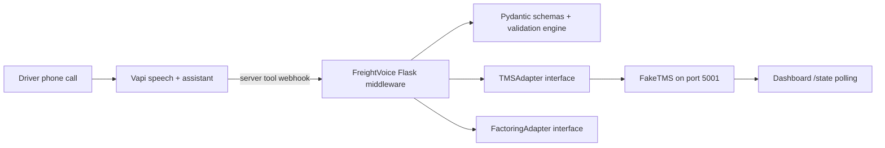

# FreightVoice

FreightVoice lets truck drivers complete post-delivery invoicing documentation with a phone call.

## The Demo In 30 Seconds

```bash
make demo
```

Open [http://localhost:5000/dashboard](http://localhost:5000/dashboard), then run:

```bash
.venv/bin/python demo/simulate_call.py
```

Watch the three seeded loads move through pending, delivered, invoiced, and flagged states.

## Architecture Diagram



## The Mock/Real Boundary Stated Plainly

The only mock is the FakeTMS on port 5001. The webhook path, validation engine, and adapter interfaces are production code. Switching to Samsara means implementing one class and changing one env var.

## Going To Production

1. Implement `SamsaraAdapter` or `MotiveAdapter` by filling in the `NotImplementedError` stubs in `freightvoice/adapters/`.
2. Set `FREIGHTVOICE_TMS=samsara` and `SAMSARA_API_KEY=...`.
3. Deploy FreightVoice to any HTTPS-accessible host.
4. Update the `server.url` in all four Vapi tool definitions.
5. Point the Vapi assistant at your Nebius Token Factory endpoint. See `docs/VAPI_SETUP.md`.

## Config Reference

| Env var | Type | Default | Purpose |
| --- | --- | --- | --- |
| `FREIGHTVOICE_PORT` | int | `5000` | FreightVoice Flask port. |
| `FAKETMS_URL` | string | `http://localhost:5001` | Base URL for FakeTMS. |
| `FREIGHTVOICE_TMS` | string | `fake` | TMS adapter: `fake`, `samsara`, or `motive`. |
| `FREIGHTVOICE_FACTORING` | string | `fake` | Factoring adapter: `fake` or `rts`. |
| `VAPI_AUTH_TOKEN` | string | empty | Optional token reference for Vapi configuration. |
| `NEBIUS_API_KEY` | string | empty | Optional key for Vapi BYOK/Nebius setup. |
| `WEIGHT_VARIANCE_PCT` | float | `5.0` | Weight variance threshold. |
| `PIECE_VARIANCE_ALLOW` | int | `0` | Allowed piece shortage before flagging. |
| `WEBHOOK_SECRET` | string | empty | Shared webhook secret. Empty means dev mode. |
| `AUTO_INVOICE_BELOW_SEVERITY` | string | `warning` | Lowest severity that blocks auto-invoicing. |
| `FAKETMS_DATABASE_URL` | string | `sqlite:///faketms.sqlite3` | FakeTMS database URL. |
| `FAKETMS_PORT` | int | `5001` | FakeTMS Flask port. |

## Running Tests

```bash
.venv/bin/python -m pytest tests/ -v
```
